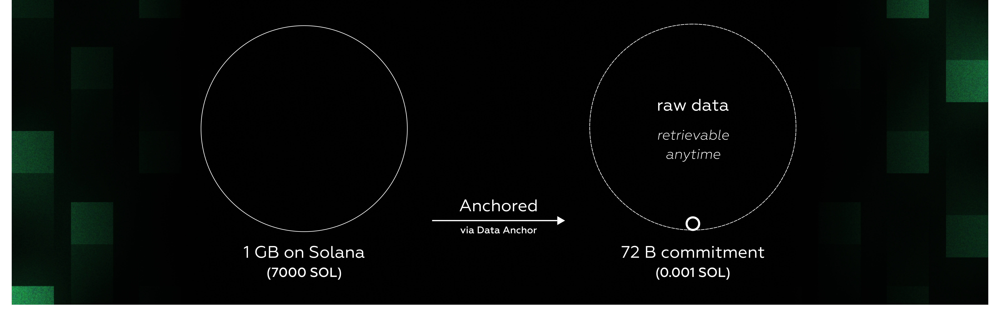

# Data Anchor

<figure><figcaption></figcaption></figure>

In the context of a rollup, the Data Anchor is responsible for the storage of transaction batches. To minimize the on-chain footprint and rent cost, this data needs to be packed, compressed, and stored efficiently in the cheap ledger history and only commitments can be retained in the expensive accounts space. However, the Data Anchor isn’t limited to transaction storage—it can manage arbitrary data, such as raw data points and proofs of computation or availability.

In particular, beyond rollups, this is useful for data-intensive use cases like DePIN projects, which can generate a massive volume of metrics. These networks often involve hundreds of thousands of nodes sending concurrent data points, which translates into tens of millions of requests per minute. At this scale, it’s infeasible to persist all of the data on-chain from both a technical and economic sense.

The key distinction between a regular rollup and a data rollup is that the latter stores data off-chain and commits to it on-chain. It can be considered a subset of a standard rollup since there is minimal or no execution occurring. For example, limited computation such as the generation of small ZK proofs or Merkle paths happen off-chain, as opposed to general-purpose execution, and these proofs can be stored on-chain via the Data Anchor.
