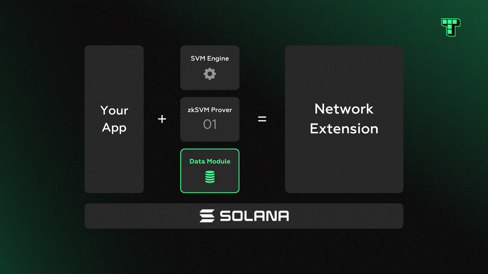

# Data Module

#### Preliminary Motivation

<figure><figcaption></figcaption></figure>

In the context of a rollup, the data module is responsible for the storage of transaction batches. To minimize the on-chain footprint and rent cost, this data needs to be packed, compressed, and stored efficiently in the cheap ledger history and only commitments can be retained in the expensive accounts space. However, the data module isn’t limited to transaction storage—it can manage arbitrary data, such as raw data points and proofs of computation or availability.

In particular, beyond rollups, this is useful for data-intensive use cases like DePIN projects, which can generate a massive volume of metrics. These networks often involve hundreds of thousands of nodes sending concurrent data points, which translates into tens of millions of requests per minute. At this scale, it’s infeasible to persist all of the data on-chain from both a technical and economic sense.

The key distinction between a regular rollup and a data rollup is that the latter stores data off-chain and commits to it on-chain. It can be considered a subset of a standard rollup since there is minimal or no execution occurring. For example, limited computation such as the generation of small ZK proofs or Merkle paths happen off-chain, as opposed to general-purpose execution, and these proofs can be stored on-chain via the data module.

#### Under the Hood

<figure><figcaption></figcaption></figure>

The data module leverages a modified version of state compression.

For each dataset, the module hashes individual elements and generates a commitment over the whole set. This commitment is saved in Solana’s accounts space, while a compressed form of the original data is stored in Solana’s ledger history. If longer term storage is needed beyond the ledger’s short lifespan of a few days, the module supports external storage providers such as IPFS, Light Protocol’s archival nodes, or self-hosted cloud databases.

It’s easy to check the presence or absence of any data element by submitting a Merkle proof on-chain. The data is temporary and can be removed after a specified period or event, e.g. X time has elapsed or Y event has occurred, which puts a maximum time bound on the elements. Since Solana requires rent for accounts, removing outdated data allows rent to be reclaimed and prevents the lock-up of increasing amounts of capital over time.
