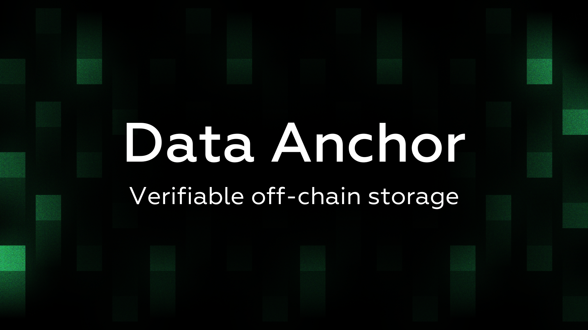

# SVM Engine Module

In the context of scaling solutions, execution layers are responsible for processing transactions computing state updates. While Solana’s architecture offers high throughput and parallel execution, some applications require greater performance guarantees and isolation to avoid shared resource bottlenecks. For instance, high-frequency trading platforms and data-intensive applications need consistent transaction finality and low latency, which can be difficult to achieve in a global execution environment during periods of peak demand.

<figure><figcaption></figcaption></figure>

Traditional solutions like rollups address these challenges by moving computation off-chain and submitting proofs back to Layer 1. However, this introduces additional complexity, delays settlement finality, and fragments liquidity. The **SVM Engine module** takes a different approach by operating natively within Solana’s architecture. It enables developers to create **customized execution environments** that retain Solana’s unified liquidity, composability, and Layer 1 security while isolating specific workloads to achieve consistent performance.

This is particularly valuable for use cases like high frequency trading and permissioned environments, where custom execution logic and resource allocation are critical for scalability. The SVM Engine module allows developers to achieve rollup-like performance benefits without requiring off-chain proofs, separate settlement layers, or fragmented ecosystems.
