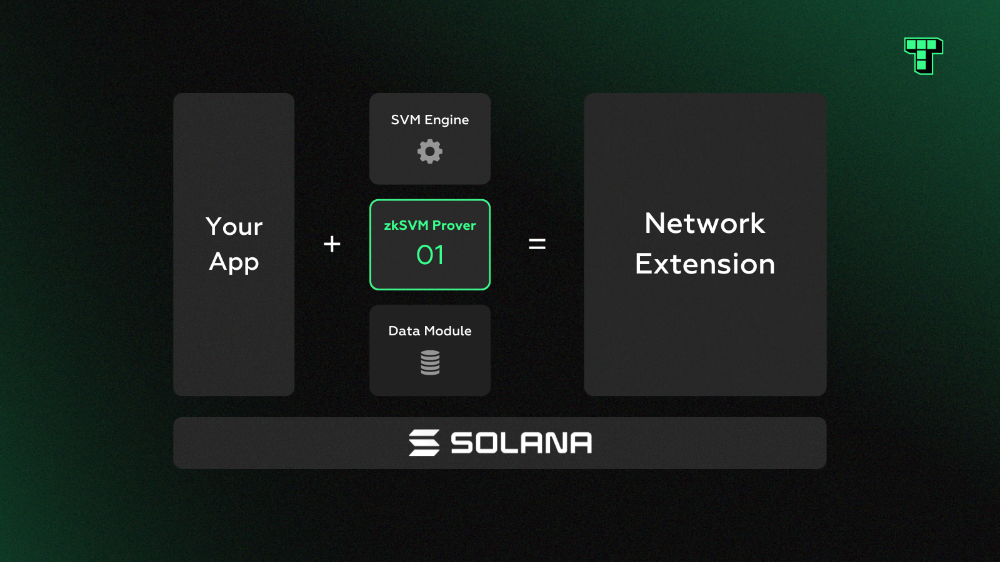

# zkSVM Prover Module

Termina’s zkSVM module is designed to bring Solana a new level of scalability and privacy by leveraging zero-knowledge proofs (ZKPs) for any SVM transaction. This not only enables the zkSVM to generate non-interactive rollup proofs that can resolve disputes in a few hours, drastically shortening existing challenge windows that are several days in length, but it can also secure high throughput and privacy-preserving applications outside of rollups.

<figure><figcaption></figcaption></figure>

The idea is straightforward: instead of executing transactions directly on the L1, generate a ZKP over the same computation off-chain, and simply verify the proof on-chain. This approach can significantly improve efficiency and performance while also providing privacy guarantees with advanced ZKPs (such as Groth16 and PLONK) that don’t leak any information.

The zkSVM prover was built on a general-purpose ZK virtual machine, rather than handrolled circuits, which makes it easy to apply bug fixes or new features to the SVM as they become available upstream. Specifically, the module was developed on Succinct’s SP1, but it should be compatible with any RISCV-based zkVM.

<figure><figcaption></figcaption></figure>

The **zkSVM module** is a template solution for integrating ZKPs into Solana’s ecosystem, enabling advanced scalability, faster dispute resolution, and enhanced privacy—without requiring separate blockchain layers.

It allows developers to:

* Achieve faster dispute resolution in rollups with non-interactive ZKPs.
* Scale applications within Solana’s infrastructure while relying on the L1 as the source of truth.
* Leverage privacy-preserving ZKP systems for sensitive or complex transaction workflows.
