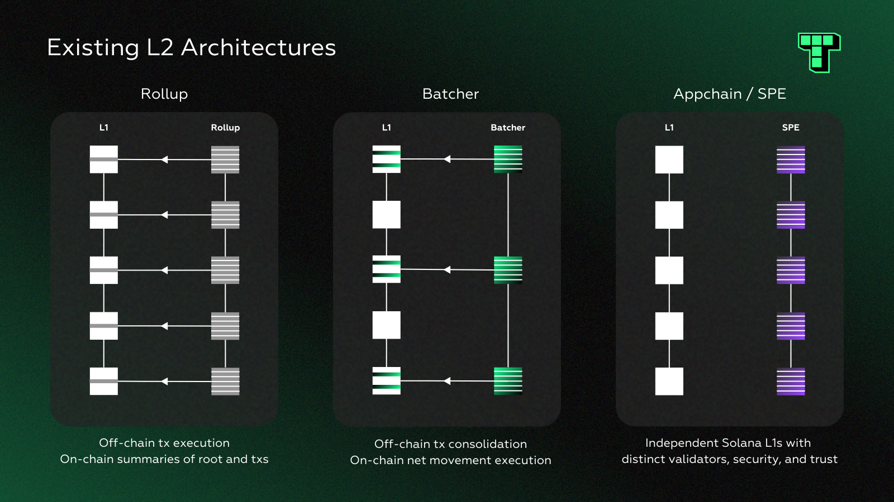

# Existing Scaling Solutions

While Solana’s core infrastructure provides high speed and composability, the growing complexity and diversity of SVM dApps requires tailored solutions to provide congestion resistance, enhanced privacy, and advanced data processing.

One common misconception is that Solana doesn’t need L2s when in fact the ecosystem already has a number of notable L2 projects. Please see [this blog](https://www.termina.technology/post/svm-usecases) for a high-level exploration of these dApps. The scaling solutions that have emerged can be organized into three main categories: rollups, batchers, and [Solana Permissioned Environments](#user-content-fn-1)[^1] (SPEs). However, each of these present a unique set of tradeoffs and often diverge from Solana’s vision of a **globally unified state machine** and its commitment to preserving liquidity and interoperability.

<figure><figcaption></figcaption></figure>

<table><thead><tr><th width="144.46087646484375">Type</th><th width="226.7747802734375">How It Works</th><th>Tradeoffs</th><th>Examples</th></tr></thead><tbody><tr><td><strong>Rollups</strong></td><td>Executes transactions off-chain and sends state summaries to Solana, secured by fault proofs</td><td>Can fragment state &#x26; liquidity</td><td>Zeta’s <strong>Bullet</strong> L2 (perpetuals DEX)</td></tr><tr><td><strong>Batchers</strong></td><td>Combines transactions off-chain and re-executes the net transactions on Solana</td><td>Adds delay before execution</td><td><strong>Code</strong> (P2P payments),  <strong>Cube</strong> (hybrid CEX/DEX)</td></tr><tr><td><strong>Appchains</strong> / <strong>SPEs</strong></td><td>Uses its own validator set and operates independently from Solana mainnet</td><td>Separate trust model &#x26; liquidity</td><td><strong>Pyth</strong> (oracle network), <strong>Spherenet</strong> (merchant payments)</td></tr></tbody></table>

[^1]: A private Solana-based network with restricted validator access and custom configurations.
