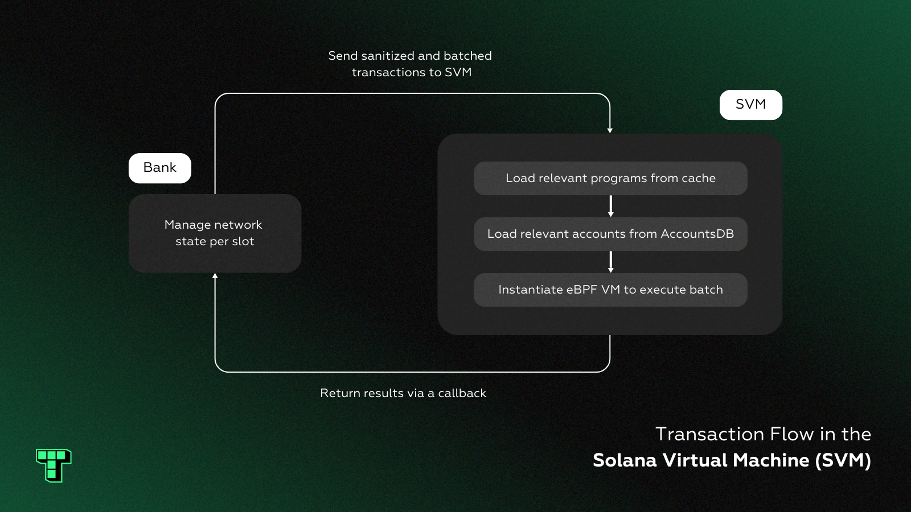

# Solana Virtual Machine (SVM)

Solana is a leading blockchain network designed for widespread adoption. It operates as a [global state machine](#user-content-fn-1)[^1] that is fast, open, and decentralized. Mainnet delivers high throughput, low fees, and supports a thriving ecosystem of dApps in DeFi, PayFi, DePIN, and gaming.

Solana has introduced several key innovations that’ve redefined the capabilities of distributed networks. These include:

* [**Turbine**](https://docs.anza.xyz/consensus/turbine-block-propagation), a block propagation protocol that enhances node communication.
* [**Gulfstream**](https://solana.com/news/gulf-stream--solana-s-mempool-less-transaction-forwarding-protocol), which eliminates the need for mempools by forwarding transaction information to validators ahead of time.
* [**Proof of History**](https://solana.com/news/proof-of-history), a consensus mechanism that enables greater scalability by encoding the passage of time into the blockchain.&#x20;

However, one of the most important contributions is the Solana Virtual Machine (SVM), which has continued to generate significant attention and interest.

<figure><figcaption></figcaption></figure>

Although there is no formal specification of the Solana Virtual Machine (SVM), the Anza team—formerly known as Solana Labs—has already modularized the SVM within the [Agave validator client](https://github.com/anza-xyz/agave).

The SVM serves as an advanced execution engine for Solana programs, or smart contracts. It provides a high-performance environment that can process transaction batches in parallel and drastically reduce both latency and cost. This directly addresses the core issues of low throughput and high fees that are prevalent in older blockchain architectures like Ethereum and Bitcoin.

Anza’s SVM API is designed to be flexible, which allows developers to tailor its functionality to their specific needs. This includes custom implementations for callbacks, banking operations, and state storage that are crucial for emerging use cases. Those looking to delve deeper can find additional information in Anza’s [SVM explainer](https://www.anza.xyz/blog/anzas-new-svm-api).

[^1]: A system where all nodes share and update a single, synchronized state.
